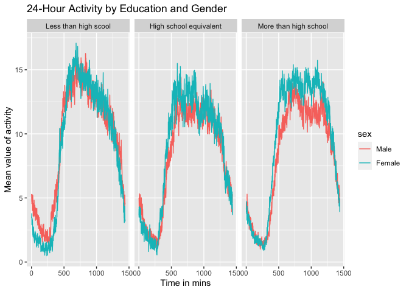

p8105_hw3_lt2949
================
Li Tian
2023-10-10

``` r
library(p8105.datasets)
library(dplyr)
```

    ## 
    ## Attaching package: 'dplyr'

    ## The following objects are masked from 'package:stats':
    ## 
    ##     filter, lag

    ## The following objects are masked from 'package:base':
    ## 
    ##     intersect, setdiff, setequal, union

``` r
library(ggplot2)
library(readxl)
library(tidyr)
```

# Problem1

``` r
data("instacart")
```

# Problem2

``` r
# Import the data
data("brfss_smart2010")

# Clean the data
cleaned_bs2010 <- brfss_smart2010 |>
  janitor::clean_names() |>
   rename("state_id" = "locationabbr",
          "county_id" = "locationdesc") |>
  filter(topic == "Overall Health",
         response %in% c("Excellent", "Very good", "Good", "Fair", "Poor")) |>
  mutate(response = factor(response, levels = c("Poor", "Fair", "Good", "Very good", "Excellent"), ordered = TRUE)) 
```

``` r
# Convert "year" to numeric
cleaned_bs2010$year <- as.numeric(cleaned_bs2010$year)

# Filter processing 
states_2002 <-
  cleaned_bs2010 |>
  filter(year == 2002) |>
  group_by(state_id) |>
  summarise(num_location2002 = n_distinct(county_id)) |>
  filter(num_location2002 >=7)

states_2010 <- 
  cleaned_bs2010 |>
  filter(year == 2010) |>
  group_by(state_id) |>
  summarise(num_location2010 = n_distinct(county_id)) |>
  filter(num_location2010 >= 7)

print(states_2002$state_id)
```

    ## [1] "CT" "FL" "MA" "NC" "NJ" "PA"

``` r
print(states_2010$state_id)
```

    ##  [1] "CA" "CO" "FL" "MA" "MD" "NC" "NE" "NJ" "NY" "OH" "PA" "SC" "TX" "WA"

In 2002, CT, FL, MA, NC, NJ, PA those 6 states were observed at 7 or
more locations.  
In 2010, those 14 states were observed at 7 or more locations.

``` r
# Spaghetti plot
excellent_data <- 
  cleaned_bs2010 |>
  filter(response == "Excellent") |>
  group_by(year, state_id) |>
  summarise(avg_data_value = mean(data_value, na.rm = TRUE))
```

    ## `summarise()` has grouped output by 'year'. You can override using the
    ## `.groups` argument.

``` r
ggplot(excellent_data, aes(x = year, y = avg_data_value, group = state_id, color = state_id)) +  geom_line() +
  labs(title = "Average Value of 'Excellent' Responses Over Time by State",
       x = "Year",
       y = "Average Data Value") +
  theme_dark() 
```

<!-- -->

``` r
# Two-panel plot
ny_data <- 
  cleaned_bs2010 |>
  filter(state_id == "NY", year %in% c(2006, 2010))

ggplot(ny_data, aes(x = response, y = data_value, fill = response)) +
  geom_boxplot() +
  facet_wrap(~year, scales = "free") +
  labs(title = "Distribution of Data Value for NY State in 2006 and 2010",
       x = "Response",
       y = "Data Value") 
```

<!-- -->

# Problem3

``` r
# Import and clean two datasets
demographic_data <-
  read.csv("nhanes_covar.csv", skip = 4) |>
  janitor::clean_names() |>
  filter(age >= 21) |>
  drop_na() |>
  mutate(
    education = recode(education, 
                       "1" = "Less than high scool", 
                       "2" = "High school equivalent", 
                       "3" = "More than high school"),
    sex = recode(sex, "1" = "Male", "2" = "Female"))
  
accelerometer_data <-
  read.csv("nhanes_accel.csv") |>
  janitor::clean_names() 
  
# Tidy and Merge two datasets
cleaned_data <- 
  left_join(demographic_data, accelerometer_data, by = "seqn") |>
  rename("participant_id" = "seqn") |>
  mutate(sex = factor(sex, levels = c("Male", "Female")),
         education = factor(education,levels = c(
           "Less than high scool", 
           "High school equivalent", 
           "More than high school", ordered = TRUE)
          )) 
```

``` r
# Produce  a reader-friendly table
reader_table <- 
  cleaned_data |>
  group_by(sex, education) |>
  summarise(count = n())
```

    ## `summarise()` has grouped output by 'sex'. You can override using the `.groups`
    ## argument.

``` r
print(reader_table)
```

    ## # A tibble: 6 × 3
    ## # Groups:   sex [2]
    ##   sex    education              count
    ##   <fct>  <fct>                  <int>
    ## 1 Male   Less than high scool      27
    ## 2 Male   High school equivalent    35
    ## 3 Male   More than high school     56
    ## 4 Female Less than high scool      28
    ## 5 Female High school equivalent    23
    ## 6 Female More than high school     59

``` r
# Visualization of the age distribution
ggplot(cleaned_data, aes(x = age, fill = sex)) +
  geom_histogram(alpha = 0.5, position = "identity") +
  facet_wrap(~ education) +
  labs(title = "Age Distribution by Sex and Education") +
  theme(legend.position = "bottom")
```

    ## `stat_bin()` using `bins = 30`. Pick better value with `binwidth`.

<!-- -->

``` r
# Calculate a total activity variable
total_activity_data <- 
  cleaned_data |>
  rowwise() |>
  mutate(total_activity = sum(c_across(starts_with("min"))))

# Visualization the total activity
ggplot(total_activity_data, aes(x = age, y = total_activity, color = sex)) +
  geom_point(alpha = .7) +
  geom_smooth() +
  facet_wrap(~ education) +
  labs(title = "Total Activity vs Age by Sex and Education")
```

    ## `geom_smooth()` using method = 'loess' and formula = 'y ~ x'

<!-- -->

``` r
avg_activity_data <-
  cleaned_data |>
  group_by(education, sex) |>
  summarise(avg_activity = mean(c_across(starts_with("min")), na.rm = TRUE), .groups = "drop")
```
