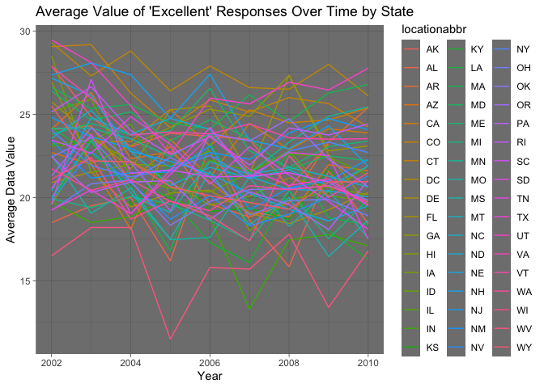
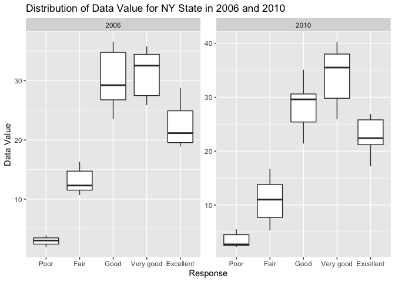

p8105_hw3_lt2949
================
Li Tian
2023-10-10

``` r
library(p8105.datasets)
library(dplyr)
```

    ## 
    ## Attaching package: 'dplyr'

    ## The following objects are masked from 'package:stats':
    ## 
    ##     filter, lag

    ## The following objects are masked from 'package:base':
    ## 
    ##     intersect, setdiff, setequal, union

``` r
library(ggplot2)
```

# Problem1

``` r
data("instacart")
```

# Problem2

``` r
# Import the data
data("brfss_smart2010")

# Clean the data
cleaned_bs2010 <- brfss_smart2010 |>
  janitor::clean_names() |>
  filter(topic == "Overall Health",
         response %in% c("Excellent", "Very good", "Good", "Fair", "Poor")) |>
  mutate(response = factor(response, levels = c("Poor", "Fair", "Good", "Very good", "Excellent"), ordered = TRUE))
```

``` r
# Convert "year" to numeric
cleaned_bs2010$year <- as.numeric(cleaned_bs2010$year)

# Filter processing 
states_2002 <-
  cleaned_bs2010 |>
  filter(year == 2002) |>
  group_by(locationabbr) |>
  summarise(num_location2002 = n_distinct(locationdesc)) |>
  filter(num_location2002 >=7)

states_2010 <- 
  cleaned_bs2010 |>
  filter(year == 2010) |>
  group_by(locationabbr) |>
  summarise(num_location2010 = n_distinct(locationdesc)) |>
  filter(num_location2010 >= 7)

print(states_2002$locationabbr)
```

    ## [1] "CT" "FL" "MA" "NC" "NJ" "PA"

``` r
print(states_2010$locationabbr)
```

    ##  [1] "CA" "CO" "FL" "MA" "MD" "NC" "NE" "NJ" "NY" "OH" "PA" "SC" "TX" "WA"

In 2002, CT, FL, MA, NC, NJ, PA those 6 states were observed at 7 or
more locations.  
In 2010, CA, CO, FL, MA, MD, NC, NE, NJ, NY, OH, PA, SC, TX, WA those 14
states were observed at 7 or more locations.

``` r
# Spaghetti plot
excellent_data <- 
  cleaned_bs2010 |>
  filter(response == "Excellent") |>
  group_by(year, locationabbr) |>
  summarise(avg_data_value = mean(data_value, na.rm = TRUE))
```

    ## `summarise()` has grouped output by 'year'. You can override using the
    ## `.groups` argument.

``` r
ggplot(excellent_data, aes(x = year, y = avg_data_value, group = locationabbr, color = locationabbr)) +  geom_line() +
  labs(title = "Average Value of 'Excellent' Responses Over Time by State",
       x = "Year",
       y = "Average Data Value") +
  theme_dark()
```

<!-- -->

``` r
# Two-panel plot
ny_data <- 
  cleaned_bs2010 |>
  filter(locationabbr == "NY", year %in% c(2006, 2010))

ggplot(ny_data, aes(x = response, y = data_value)) +
  geom_boxplot() +
  facet_wrap(~year, scales = "free") +
  labs(title = "Distribution of Data Value for NY State in 2006 and 2010",
       x = "Response",
       y = "Data Value")
```

<!-- -->
