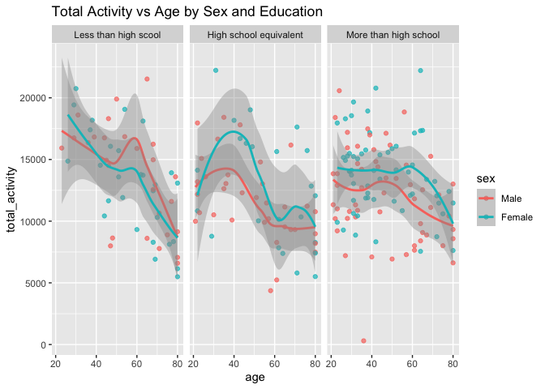
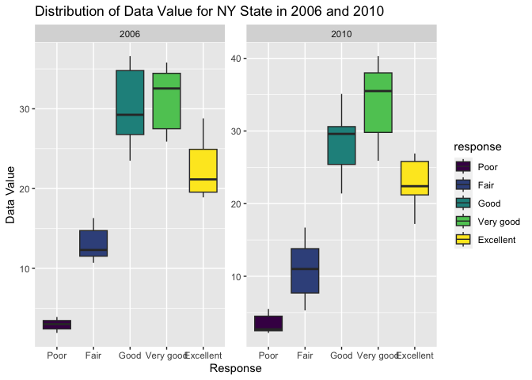
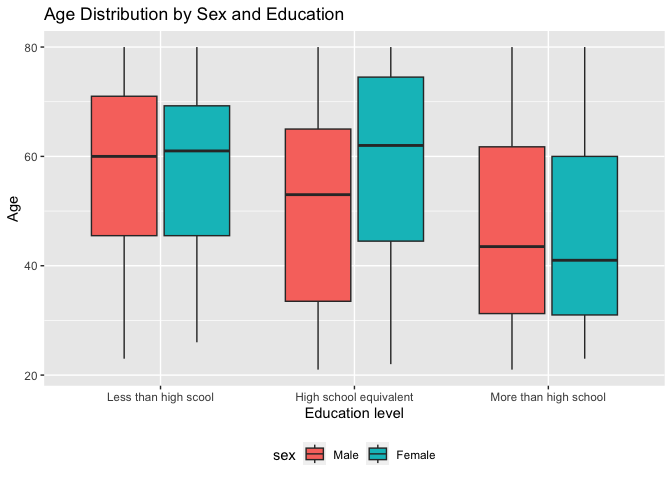
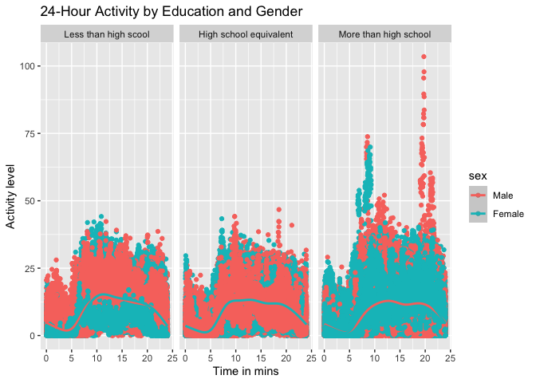

p8105_hw3_lt2949
================
Li Tian
2023-10-10

``` r
library(p8105.datasets)
library(dplyr)
```

    ## 
    ## Attaching package: 'dplyr'

    ## The following objects are masked from 'package:stats':
    ## 
    ##     filter, lag

    ## The following objects are masked from 'package:base':
    ## 
    ##     intersect, setdiff, setequal, union

``` r
library(ggplot2)
library(readxl)
library(tidyr)
library(stringr)
library(tidyverse)
```

    ## ── Attaching core tidyverse packages ──────────────────────── tidyverse 2.0.0 ──
    ## ✔ forcats   1.0.0     ✔ readr     2.1.4
    ## ✔ lubridate 1.9.2     ✔ tibble    3.2.1
    ## ✔ purrr     1.0.2

    ## ── Conflicts ────────────────────────────────────────── tidyverse_conflicts() ──
    ## ✖ dplyr::filter() masks stats::filter()
    ## ✖ dplyr::lag()    masks stats::lag()
    ## ℹ Use the conflicted package (<http://conflicted.r-lib.org/>) to force all conflicts to become errors

``` r
library(ggridges)
library(patchwork)
```

# Problem1

``` r
data("instacart")

instacart = 
  instacart |> 
  as_tibble()
```

This dataset contains 1384617 rows and 15 columns, with each row
resprenting a single product from an instacart order. Variables include
identifiers for user, order, and product; the order in which each
product was added to the cart. There are several order-level variables,
describing the day and time of the order, and number of days since prior
order. Then there are several item-specific variables, describing the
product name (e.g. Yogurt, Avocado), department (e.g. dairy and eggs,
produce), and aisle (e.g. yogurt, fresh fruits), and whether the item
has been ordered by this user in the past. In total, there are 39123
products found in 131209 orders from 131209 distinct users.

Below is a table summarizing the number of items ordered from aisle. In
total, there are 134 aisles, with fresh vegetables and fresh fruits
holding the most items ordered by far.

``` r
instacart |> 
  count(aisle) |> 
  arrange(desc(n))
```

    ## # A tibble: 134 × 2
    ##    aisle                              n
    ##    <chr>                          <int>
    ##  1 fresh vegetables              150609
    ##  2 fresh fruits                  150473
    ##  3 packaged vegetables fruits     78493
    ##  4 yogurt                         55240
    ##  5 packaged cheese                41699
    ##  6 water seltzer sparkling water  36617
    ##  7 milk                           32644
    ##  8 chips pretzels                 31269
    ##  9 soy lactosefree                26240
    ## 10 bread                          23635
    ## # ℹ 124 more rows

Next is a plot that shows the number of items ordered in each aisle.
Here, aisles are ordered by ascending number of items.

``` r
instacart |> 
  count(aisle) |> 
  filter(n > 10000) |> 
  mutate(aisle = fct_reorder(aisle, n)) |> 
  ggplot(aes(x = aisle, y = n)) + 
  geom_point() + 
  labs(title = "Number of items ordered in each aisle") +
  theme(axis.text.x = element_text(angle = 60, hjust = 1))
```

<!-- -->

Our next table shows the three most popular items in aisles
`baking ingredients`, `dog food care`, and `packaged vegetables fruits`,
and includes the number of times each item is ordered in your table.

``` r
instacart |> 
  filter(aisle %in% c("baking ingredients", "dog food care", "packaged vegetables fruits")) |>
  group_by(aisle) |> 
  count(product_name) |> 
  mutate(rank = min_rank(desc(n))) |> 
  filter(rank < 4) |> 
  arrange(desc(n)) |>
  knitr::kable()
```

| aisle                      | product_name                                  |    n | rank |
|:---------------------------|:----------------------------------------------|-----:|-----:|
| packaged vegetables fruits | Organic Baby Spinach                          | 9784 |    1 |
| packaged vegetables fruits | Organic Raspberries                           | 5546 |    2 |
| packaged vegetables fruits | Organic Blueberries                           | 4966 |    3 |
| baking ingredients         | Light Brown Sugar                             |  499 |    1 |
| baking ingredients         | Pure Baking Soda                              |  387 |    2 |
| baking ingredients         | Cane Sugar                                    |  336 |    3 |
| dog food care              | Snack Sticks Chicken & Rice Recipe Dog Treats |   30 |    1 |
| dog food care              | Organix Chicken & Brown Rice Recipe           |   28 |    2 |
| dog food care              | Small Dog Biscuits                            |   26 |    3 |

Finally is a table showing the mean hour of the day at which Pink Lady
Apples and Coffee Ice Cream are ordered on each day of the week. This
table has been formatted in an untidy manner for human readers. Pink
Lady Apples are generally purchased slightly earlier in the day than
Coffee Ice Cream, with the exception of day 5.

``` r
instacart |>
  filter(product_name %in% c("Pink Lady Apples", "Coffee Ice Cream")) |>
  group_by(product_name, order_dow) |>
  summarize(mean_hour = mean(order_hour_of_day)) |>
  pivot_wider(
    names_from = order_dow, 
    values_from = mean_hour) |>
  knitr::kable(digits = 2)
```

    ## `summarise()` has grouped output by 'product_name'. You can override using the
    ## `.groups` argument.

| product_name     |     0 |     1 |     2 |     3 |     4 |     5 |     6 |
|:-----------------|------:|------:|------:|------:|------:|------:|------:|
| Coffee Ice Cream | 13.77 | 14.32 | 15.38 | 15.32 | 15.22 | 12.26 | 13.83 |
| Pink Lady Apples | 13.44 | 11.36 | 11.70 | 14.25 | 11.55 | 12.78 | 11.94 |

# Problem2

``` r
# Import the data
data("brfss_smart2010")

# Clean the data
cleaned_bs2010 <- brfss_smart2010 |>
  janitor::clean_names() |>
  # Rename suitable vairiable names
   rename("state_id" = "locationabbr",
          "county_id" = "locationdesc") |>
  filter(topic == "Overall Health",
         response %in% c("Excellent", "Very good", "Good", "Fair", "Poor")) |>
  mutate(response = factor(response, levels = c("Poor", "Fair", "Good", "Very good", "Excellent"), ordered = TRUE)) 
```

``` r
# Convert "year" to numeric
cleaned_bs2010$year <- as.numeric(cleaned_bs2010$year)

# Filter processing 
states_2002 <-
  cleaned_bs2010 |>
  filter(year == 2002) |>
  group_by(state_id) |>
  summarise(num_location2002 = n_distinct(county_id)) |>
  filter(num_location2002 >=7)
knitr::kable(states_2002)
```

| state_id | num_location2002 |
|:---------|-----------------:|
| CT       |                7 |
| FL       |                7 |
| MA       |                8 |
| NC       |                7 |
| NJ       |                8 |
| PA       |               10 |

``` r
states_2010 <- 
  cleaned_bs2010 |>
  filter(year == 2010) |>
  group_by(state_id) |>
  summarise(num_location2010 = n_distinct(county_id)) |>
  filter(num_location2010 >= 7)
knitr::kable(states_2010)
```

| state_id | num_location2010 |
|:---------|-----------------:|
| CA       |               12 |
| CO       |                7 |
| FL       |               41 |
| MA       |                9 |
| MD       |               12 |
| NC       |               12 |
| NE       |               10 |
| NJ       |               19 |
| NY       |                9 |
| OH       |                8 |
| PA       |                7 |
| SC       |                7 |
| TX       |               16 |
| WA       |               10 |

In 2002, CT, FL, MA, NC, NJ, PA those 6 states were observed at 7 or
more locations.  
In 2010, CA, CO, FL, MA, MD, NC, NE, NJ, NY, OH, PA, SC, TX, WA those 14
states were observed at 7 or more locations.

``` r
# Spaghetti plot
excellent_data <- 
  cleaned_bs2010 |>
  filter(response == "Excellent") |>
  group_by(year, state_id) |>
  summarise(avg_data_value = mean(data_value, na.rm = TRUE))
```

    ## `summarise()` has grouped output by 'year'. You can override using the
    ## `.groups` argument.

``` r
ggplot(excellent_data, aes(x = year, y = avg_data_value, group = state_id, color = state_id)) +  geom_line() +
  labs(title = "Average Value of 'Excellent' Responses Over Time by State",
       x = "Year",
       y = "Average Data Value") +
  theme_dark() 
```

<!-- -->
Here is the “spaghetti” plot, showing the average value of ‘Excellent’
response from 2002 to 2010 by the location states. Every state is
represented by a distinct line that showcases the shifts in average data
values over this period. These values generally hover between 15 to 30.

``` r
# Two-panel plot
ny_data <- 
  cleaned_bs2010 |>
  filter(state_id == "NY", year %in% c(2006, 2010))

ggplot(ny_data, aes(x = response, y = data_value, fill = response)) +
  geom_boxplot() +
  facet_wrap(~year, scales = "free") +
  labs(title = "Distribution of Data Value for NY State in 2006 and 2010",
       x = "Response",
       y = "Data Value") 
```

<!-- -->
This two-panel plot displays the data value distribution for five
response levels across locations in NY state for the years 2006 and
2010. In both the 2006 and 2010 plots, the “Poor” response has the
smallest range of data values, while “Very Good” exhibits the broadest
range.

# Problem3

``` r
# Import and clean two datasets
demographic_data <-
  read.csv("nhanes_covar.csv", skip = 4) |>
  janitor::clean_names() |>
  filter(age >= 21) |>
  drop_na() |>
  mutate(
    education = recode(education, 
                       "1" = "Less than high scool", 
                       "2" = "High school equivalent", 
                       "3" = "More than high school"),
    sex = recode(sex, "1" = "Male", "2" = "Female"))
  
accelerometer_data <-
  read.csv("nhanes_accel.csv") |>
  janitor::clean_names() 
  
# Tidy and Merge two datasets
cleaned_data <- 
  left_join(demographic_data, accelerometer_data, by = "seqn") |>
  rename("participant_id" = "seqn") |>
  mutate(sex = factor(sex, levels = c("Male", "Female")),
         education = factor(education,levels = c(
           "Less than high scool", 
           "High school equivalent", 
           "More than high school", ordered = TRUE)
          )) 
```

We import and cleaned two datasets, then merge them by “seqn” which I
rename as `participant_id`.

``` r
# Produce  a reader-friendly table
reader_table <- 
  cleaned_data |>
  group_by(sex, education) |>
  summarise(count = n(), .groups = "drop") |>
  pivot_wider(names_from = sex, values_from = count) |>
  knitr::kable()

# Visualization of the age distribution
ggplot(cleaned_data, aes(x = education, y = age, fill = sex)) +
  geom_boxplot() +
  labs(title = "Age Distribution by Sex and Education",
       x = "Education level",
       y = "Age") +
  theme(legend.position = "bottom")
```

<!-- -->
The box plot illustrates the age distribution across three educational
levels for both genders. The table indicates a higher number of females
in the advanced education category, while more males possess a high
school-equivalent education.

``` r
activity_data <- cleaned_data |>
  pivot_longer(
    min1:min1440,
    names_to="minute",
    values_to="activity_level",
    names_prefix = "min"
  ) |>
  mutate(minute = as.numeric(minute) / 60)
         
ggplot(activity_data, aes(x = minute, y = activity_level, color = sex)) +
  geom_point() +
  geom_smooth() +
  facet_grid(~education) +
  labs(title = "24-Hour Activity by Education and Gender", 
       x = "Time in mins",
       y = "Activity level") 
```

    ## `geom_smooth()` using method = 'gam' and formula = 'y ~ s(x, bs = "cs")'

<!-- -->
The visual displays activity levels (0 to 100) for three education
levels over time, segmented by minutes. Males are in purple, females in
yellow. Trend lines show average activity for each gender, revealing
distinct patterns across education categories. A color legend clarifies
gender differentiation.
